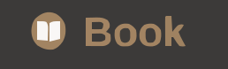

# Chess.com Analysis Icons  

Familiar & expressive analysis icons from Chess.com. Chess players around the world will recognize these!

 
 

 

## Files & Folders

- **AllIcons.png**: Original image containing all icons.
- **IconsOnly/**: Cropped icons without labels.
- **LabeledIcons/**: Cropped icons with labels.

## Uses

These icons can be used for:

- Niche and expressive [Photomoji](https://9to5google.com/2024/01/26/google-messages-photomoji-rolling-out/#:~:text=also%20announced%20that-,Photomoji,-and%20Magic%20Compose) reactions
- Custom [Slack emojis](https://enwest.slack.com/customize/emoji)
- [Discord emojis](https://support.discord.com/hc/en-us/articles/360036479811-Custom-Emojis)
- [Twitch emojis](https://help.twitch.tv/s/article/subscriber-emoticons?language=en_US)
- and whatever else you can think of!

   

## Contribute

- clean up the icons
- png transparency 
- make sizes uniform 
- find higher resolution images 
- add additional use cases
