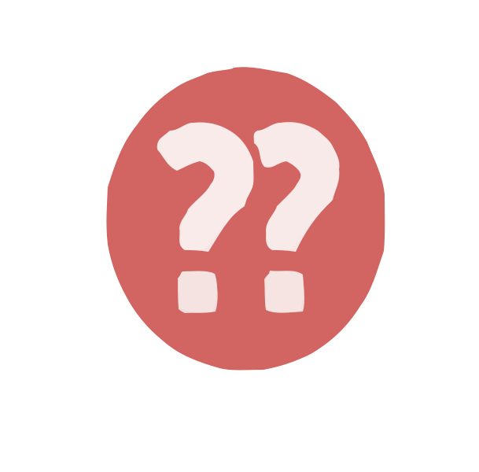

# Chess.com Analysis Icons  

Familiar & expressive analysis icons from Chess.com!

 

## Files & Folders

- **AllIcons.png**: Original image containing all icons.
- **IconsOnly/**: Cropped icons without labels.
- **LabeledIcons/**: Cropped icons with labels.

## Uses

These icons can be used as niche and expressive [Photomoji](https://9to5google.com/2024/01/26/google-messages-photomoji-rolling-out/#:~:text=also%20announced%20that-,Photomoji,-and%20Magic%20Compose) reactions, custom [Slack emojis](https://enwest.slack.com/customize/emoji), or anything else!

   

## Contribute

- clean up the icons
- png transparency 
- make sizes uniform 
- find higher resolution images 
- add additional use cases
